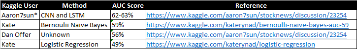

# Machine Learning Engineer Nanodegree
## Capstone Proposal - Sentiment Analysis Applied to Stock Prediction
Renato Leal de Moura Luz, July 14th, 2019

## I. Definition
### Project Overview

Sentiment Analysis refers to the use of machine learning to identify the emotional reaction to an event, document or topic. One of the possible applications of sentiment analysis is for predicting stock market movements. The internet is full of sources that represent the public opinion and sentiment about current events. Studies shows that the aggregate public mood can be correlated with Dow Jones Industrial Average Index (DJIA).

### Problem Statement

This capstone seeks a model which uses the top daily news headlines from Reddit ( /r/worldnews ) to predict stock market movement. A dataset with 8 years of daily news headlines and their respective DJIAs is available in Kaggle. The stock market movement will be modeled into a binary classification problem, where:

● 1 is when DJIA Adj Close value rose or stayed as the same

● 0 is when DJIA Adj Close value decreased .

### Metrics

The evaluation metric to be used is Area Under the Curve (AUC) which is a metric derived from receiver operating characteristic (ROC) curve. The most recent two years of the dataset (about 20%), from 2015-01-02 to 2016-07-01, is going to be reserved for testing.

## II. Analysis

### Data Exploration

First some cursory investigation is computed:

● Total number of records: 1989

● Number of records in which the index DJIA increased or stayed at the same: 1065

● Number of records in which the index DJIA decreased: 924

● Percent. of indexes which increased or stayed at the same: 53.54%

Both classes are amost equally distributed (53% vs 47%) which is good since they don’t suffer from imbalance. We can also check how the training and testing set are distributed:

● Class Balance in the Training set (first 6 years):

    ○ 1 - 54%
  
    ○ 0 - 46%
  
  
● Class Balance in the Test set (last 2 years):

    ○ 1 - 51%
    
    ○ 0 - 49%  

We can observe that the balance of the test set is slightly off from the original balance, but still can be representative since it is not too far away from the original balance. He header of the dataset is given as follows:

Top1 to Top25 are the features and refers to the top 25 headlines on Reddit News for each day. Label is the target variable. We can observe that all the headings starts with a `b` tag. This tag and other non-word characters are removed with the function `clean_text`:

### Exploratory Visualization

Let’s perform the exploratory visualization using cloud of words. First, let’s check from all the headline’s content in the dataset:

The package WordCloud was used for this visualization. Stop words were automatically removed from the visualization. We can observe that United States is the most frequent keywords in the news headline which is good since the DJIA is an American index. We can also check if there’s a difference between the cloud of words for the positive and negative class:

Cloud of words for the positive class (Label = 1)

Cloud of words for the negative class (Label = 0)

One of the words that is found in the negative class but not in the positive class is attack which might have a correlation.

### Algorithms and Techniques

First, the text data from the 25 features was cleaned (some HTML tags are still present in the original data). Next, the text was grouped and processed into feature vectors. The method bag of words was used to represent the text as numerical feature vectors. The bag of words model created a vocabulary of tokens from the headlines data and then counted. Also, the relevancy of words was evaluated using the method term frequency-inverse document frequency (tf-idf).

The bag-of-words model is a simplifying representation used in natural language processing and information retrieval (IR). In this model, a text (such as a sentence or a document) is represented as the bag (multiset) of its words, disregarding grammar and even word order but keeping multiplicity. The bag-of-words model has also been used for computer vision.

The bag-of-words model is commonly used in methods of document classification where the (frequency of) occurrence of each word is used as a feature for training a classifier.

In information retrieval, tf–idf or TFIDF, short for term frequency–inverse document frequency, is a numerical statistic that is intended to reflect how important a word is to a document in a collection or corpus. It is often used as a weighting factor in searches of information retrieval, text mining, and user modeling. The tf–idf value increases proportionally to the number of times a word appears in the document and is offset by the number of documents in the corpus that contain the word, which helps to adjust for the fact that some words appear more frequently in general. tf–idf is one of the most popular term-weighting schemes today; 83% of text-based recommender systems in digital libraries use tf–idf.

Stop words are words which are filtered out before or after processing of natural language data (text). Though "stop words" usually refers to the most common words in a language, there is no single universal list of stop words used by all natural language processing tools, and indeed not all tools even use such a list. Some tools specifically avoid removing these stop words to support phrase search.

Tokenization is the process of converting a sequence of characters (such as in a computer program or web page) into a sequence of tokens (strings with an assigned and thus identified meaning). A program that performs lexical analysis may be termed a lexer, tokenizer, or scanner, though scanner is also a term for the first stage of a lexer. A lexer is generally combined with a parser, which together analyze the syntax of programming languages, web pages, and so forth.

Stemming is the process of reducing inflected (or sometimes derived) words to their word stem, base or root form—generally a written word form. The stem need not be identical to the morphological root of the word; it is usually sufficient that related words map to the same stem, even if this stem is not in itself a valid root. Algorithms for stemming have been studied in computer science since the 1960s. Many search engines treat words with the same stem as synonyms as a kind of query expansion, a process called conflation.

In pattern recognition, the k-nearest neighbors algorithm (k-NN) is a non-parametric method used for classification and regression. In both cases, the input consists of the k closest training examples in the feature space. The output depends on whether k-NN is used for classification or regression:

In k-NN classification, the output is a class membership. An object is classified by a plurality vote of its neighbors, with the object being assigned to the class most common among its k nearest neighbors (k is a positive integer, typically small). If k = 1, then the object is simply assigned to the class of that single nearest neighbor.

In k-NN regression, the output is the property value for the object. This value is the average of the values of k nearest neighbors.
k-NN is a type of instance-based learning, or lazy learning, where the function is only approximated locally and all computation is deferred until classification. The k-NN algorithm is among the simplest of all machine learning algorithms.

In machine learning, support-vector machines (SVMs, also support-vector networks[1]) are supervised learning models with associated learning algorithms that analyze data used for classification and regression analysis. Given a set of training examples, each marked as belonging to one or the other of two categories, an SVM training algorithm builds a model that assigns new examples to one category or the other, making it a non-probabilistic binary linear classifier (although methods such as Platt scaling exist to use SVM in a probabilistic classification setting). An SVM model is a representation of the examples as points in space, mapped so that the examples of the separate categories are divided by a clear gap that is as wide as possible. New examples are then mapped into that same space and predicted to belong to a category based on the side of the gap on which they fall.

The learning algorithm Logistic Regression is initially employed since it fundamentally has probabilities as output (which is useful for the AUC metric). Later, most of the other algorithms from sklearn are also evaluated. Here’s the list of classifiers implemented:

### Benchmark
Since this dataset is from a Kaggle kernel, there is no ‘official’ benchmark available. Below are the scores from some Kaggle users who used the very same metric and test set that is going to be implemented in this project (AUC metric and 2 last years as test set):

However, this benchmark will be used as a secondary benchmark. The following list to be considered as primary benchmark :

1. A ‘dummy’ classifier with random output ( test result = 49.13% )

2. A logistic regression and a simple vectorizer with both using default parameters ( test esult = 41.36% )

The logistic regression with default parameters is performing even worse than the dummy classifier due tooverfitting in the training set. The overfitting is due to a very high number of featues (about 20 times the number of samples). The vectorizer parameter max_features played a major role here in order to limit the number of features and handle the overfitting.

This parameter is absolutely optional and should be calibrated according to the rational thinking and the data structure.

Sometimes it is not effective to transform the whole vocabulary, as the data may have some exceptionally rare words, which, if passed to TfidfVectorizer().fit(), will add unwanted dimensions to inputs in the future. One of the appropriate techniques in this case, for instance, would be to print out word frequences accross documents and then set a certain threshold for them. Imagine you have set a threshold of 50, and your data corpus consists of 100 words. After looking at the word frequences 20 words occur less than 50 times. Thus, you set max_features=80 and you are good to go.

If max_features is set to None, then the whole corpus is considered during the TF-IDF transformation. Otherwise, if you pass, say, 5 to max_features, that would mean creating a feature matrix out of the most 5 frequent words accross text documents.

## III. Methodology

### Data Preprocessing

The preprocessing went as follows:

  1. The text from the features was cleaned and HTML or terminal tags (such as `\n`) were removed using the function clear_text.
    
  2. Next, all the 25 headlines where joined and processed into feature vectors using the model bag of words .
    
        a. First CountVectorizer() from sklearn was employed
        
        b. Later, the transformation tf-idf was also evaluated
      
The preprocessing was performed using Pipelines , here’s an example:

The stop words dictionary used was the nltk.corpus - english.

The tokenizer used was the nltk.stem.porter.

The number of features was (1, 5, 10, 20, 25, 30, 40, 50, 60, 80, 100, 150, 200).

### Implementation
The implementation is summarized as follows:

Next some more details:

  ● A dataset with 1989 samples and 25 news headlines (which is later processed into vectors) was loaded as input.

  ● The most recent two years were used as the test set and the previous 6 years of data as the training set.

  ● Those 25 features are later joined and processed into feature vector. The preprocessing went as follows:
   a. The text from the features was cleaned and HTML or terminal tags (such as `\n`) were removed
        
   b. Next, the text was grouped and processed into feature vectors using the model bag of words .

  ● The AUC metric is used. As ML algorithms, the learning algorithm Logistic Regression is first evaluated since it fundamentally returns probabilities as output (which is necessary for the AUC metric). Later, other learning algorithms are also evaluated, more specifically the following list: "k Nearest Neighbors", "Linear SVM", "RBF SVM", "Decision Tree", "Random Forest", "AdaBoost", "GradientBoost", "Gaussian Naive Bayes".

  ● The hyperparameter optimization was performed using a pipeline which evaluates:

   a. A pipeline with features from the vectorizer method ( TfidfTransformer ) for example, stop_words , tokenizer (a simple one or the PorterStemmer), ngram_range , norm and use_idf.
    
   b. Also parameters from the learning algorithm are also evaluated, for example penalty and C for Logistic Regression and n_estimators for RandomForest.
    

● The model with the highest validation score is going to be used to evaluate and report the test score.

### Refinement
The AUC test score of the dummy estimator was 49% . Next, the AUC test score for Logistic Regression model using default parameters was 41.36% . The logistic regression with default parameters is performing worse than even the dummy classifier due to overfitting in the training set (the training score was 100%). 

The overfitting occoured due to a very high number of featues. The number of features is near 33000 which is more than 20 times higher than the number of samples (about 1600 samples). The vectorizer parameter max_depth
played a major role here in order to limit the number of features and handle the overfitting problem. Here’s some score when changing the value of max_depth in CountVectorizer and using Logistic Regression:

**************************************************************************
Using max_features = 1

The AUC score for the training set is 51.14%

The AUC score for the test set is 57.97%
**************************************************************************
Using max_features = 5

The AUC score for the training set is 53.19%

The AUC score for the test set is 57.73%
**************************************************************************
Using max_features = 10

The AUC score for the training set is 54.49%

The AUC score for the test set is 53.95%
**************************************************************************
Using max_features = 20

The AUC score for the training set is 55.17%

The AUC score for the test set is 53.61%
**************************************************************************
Using max_features = 25

The AUC score for the training set is 56.76%

The AUC score for the test set is 51.43%
**************************************************************************
Using max_features = 30

The AUC score for the training set is 57.27%

The AUC score for the test set is 52.67%
**************************************************************************
Using max_features = 40

The AUC score for the training set is 57.82%

The AUC score for the test set is 52.77%
**************************************************************************
Using max_features = 50

The AUC score for the training set is 58.48%

The AUC score for the test set is 54.09%
**************************************************************************
Using max_features = 60

The AUC score for the training set is 61.00%

The AUC score for the test set is 51.97%
**************************************************************************
Using max_features = 80

The AUC score for the training set is 64.42%

The AUC score for the test set is 49.87%
**************************************************************************
Using max_features = 100

The AUC score for the training set is 65.35%

The AUC score for the test set is 48.84%
**************************************************************************
Using max_features = 150

The AUC score for the training set is 67.95%

The AUC score for the test set is 48.37%
**************************************************************************
Using max_features = 200

The AUC score for the training set is 70.27%

The AUC score for the test set is 47.53%
**************************************************************************

The best test score was with max_features = 1, however the training score was lower than the test score which does not make sense - a model performing better with unseen data than with the data that it was training. The most reasonable value is max_features = 50 which led to the highest test score and still has the training score higher than the test score:

● Test score for Logistic Regression (with max_features = 50) = 54.09%

Also, some other learning algorithms were evaluated as well. Here’s a summary of test scores:

● Dummy Estimator = 49.13%

● Logistic Regression (with max_features = 50) = 54.09%

● Naive Bayes (with max_features = 50) = 54.53%

● Random Forest (with max_features = 50 and stop words) = 56.24%

## IV. Results

### Model Evaluation and Validation
The Random Forest was first chosen for GridSearchCV due to the highest performance in the initial analysis. However, GridSearchCV didn’t help to improve the best score of 56.24% in the test set. The best test score with hyperparameter optimization was 51.73% with RandomForest. Perhaps this is a more representative score since the parameters were optimized to the test set but to the validation set which avoids overfititng to the test set due to the choice of hyperparameters.

### Justification
The model chosen as final solution is Random Forest with the parameters max_depth=5, n_estimators=10, max_features=1. 

As vectorizer method it is chosen CountVectorizer with max_features = 50 and using stop words. 

It reached the highest score in the test set of 56.24% .

## V. Conclusion

### Free-Form Visualization
The following plot summarizes the best test scores obtained:

The best score was with Random Forest with 56.24% in the test set . The best reported score on Kaggle was 62%.

### Reflection
This capstone seeks a model which uses the top daily news headlines from Reddit ( /r/worldnews ) to predict stock market movement. First a Dummy estimator was implemented to serve as baseline for comparison. The AUC test score was 49%. Next, Logistic Regression with the default parameters was implemented. The score of 41% was obtained which is low due to overfitting. 

The CountVectorizer parameter max_features was evaluated in order to handle the overfitting problem. The best test score with Logistic Regression was of 54% when using max_features = 50. Finally, other models were evaluated as well. The highest test score was obtained with RandomForest of 56%. When compared to the benchmark is 7% higher than the Dummy estimation and 15% higher than Logistic Regression with default parameters.

### Improvement
The best test score is still lower than two reported scores on Kaggle (59% and 62%), so still there’s room for improvement. Also, no significant improvement was obtained with GridSearchCV. 

A further investigation is necessary with more hyperparameters and also checking if the highest obtained test score has parameters that are really representative for unseen data.

### References

1. https://en.wikipedia.org/wiki/Sentiment_analysis
2. https://arxiv.org/pdf/1610.09225.pdf
3. https://www.kaggle.com/aaron7sun/stocknews
4. https://en.wikipedia.org/wiki/Receiver_operating_characteristic
5. https://en.wikipedia.org/wiki/Bag-of-words_model
6. https://en.wikipedia.org/wiki/Tf%E2%80%93idf
